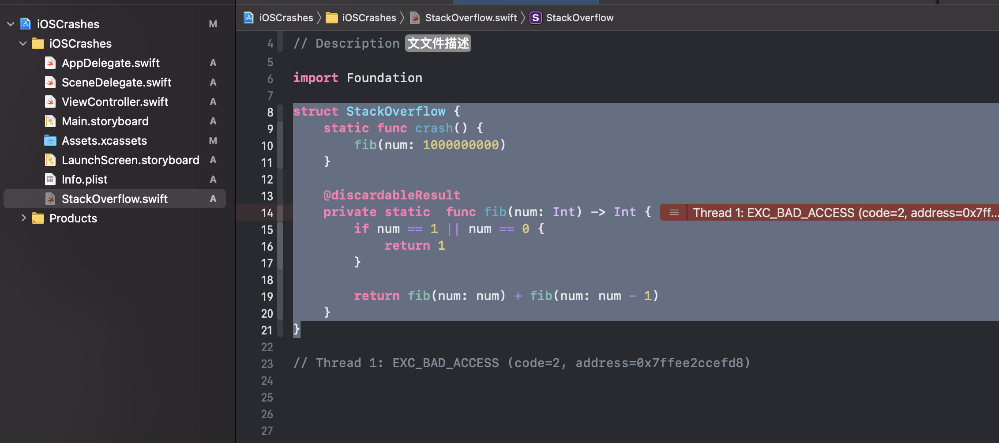
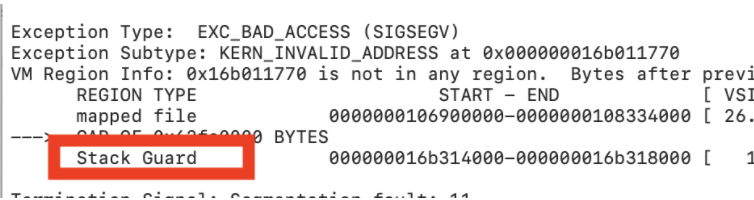

# 栈溢出
栈溢出是一个很经典的问题，平时如果我们不注意结构化我们的代码，还是很容易出现这个样的一个问题的。
## 简单的示例
```swift
struct StackOverflow {
    static func crash() {
        fib(num: 1000000000)
    }
    
    @discardableResult
    private static  func fib(num: Int) -> Int {
        if num == 1 || num == 0 {
            return 1
        }
        
        return fib(num: num) + fib(num: num - 1)
    }
}
```

运行的结果：


## 为什么会崩溃
首先了解一个概念：
线程中创建的临时变量，以及方法的调用(stack frame)都在占用一定的内存空间，而这部分空间是放在stack上的。
```swift
print("main stack size: \(Thread.main.stackSize)")

main stack size: 524288 kb
```
上面是主线程在x86架构下的stack size

> This value must be in bytes and a multiple of 4KB.

了解上面的点之后:
如果我疯狂的递归方法，每调用一次就把会一个stackframe push到 stack中。当分配的stackframe,超出系统分配的大小的时候，自然就会出现 EXC_BAD_ACCESS这样的报错


手动分配几万个变量也是一样的道理可以出现这样的情况。

## 如果确定是否是stackoverflow
1. bad_access
2. 拿到崩溃的地址 和 入参地址比较
3. symbol crash的时候系统会告诉你
 

## 如何解决
1. 增加线程分配空间大小
```swift
func notCrash() {
        thread = Thread {
            self.fib(num: 100000)
        }
        thread.stackSize = 4096 * 10000
        thread.start()
    }
```

1. 优化自己的代码结构

