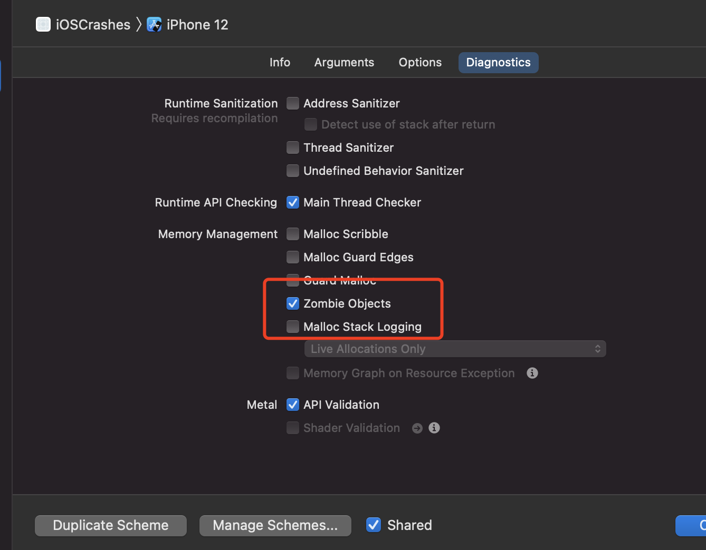
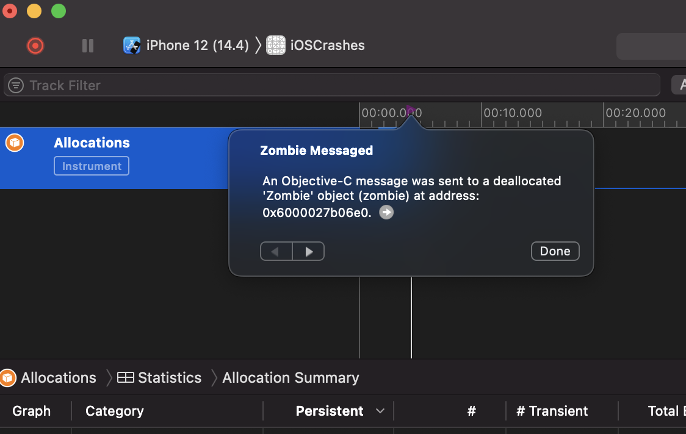

# 僵尸对象
属于EXC_BAD_ACCESS的一种，当我们在crash report中看到EXC_BAD_ACCESS的报错，又发现是zombie object的问题，绝对是一种很烦躁的事情

## 为什么zombieObject难处理
首先面对zombieObject的内存访问错误，我们有时间是无法还原崩溃的第一现场的。
比如
```swift
Terminating app due to uncaught exception 'NSInvalidArgumentException', 
reason: '-[NSNumberFormatter playSound]: 
unrecognized selector sent to instance 0x28360dac0'
```
从上面崩溃的原因来看是 `NSNumberFormatter` 调用了本身不存在的方法`playSound`。
但是你检查你的代码，完全没有这种情况。

这时候你就应该知道是`zombieObject`的问题了。
`playSound`的主体应该是`vedioPlayer`什么的任意`player`. 但是这个主体在某一个时间点被释放了。这个指针指向的堆内存被`NSNumberFormatter`的实例覆盖。
问题来了:
`crash report`里面的`backtrace`完全没有用了。
什么时候崩溃的！
什么地方奔溃的！
你完全不知道！
这就是让人烦躁的原因。

## 如何分析这个bug就是ZombieObject
* 当`backtrace`最后调用是 objc_msgSend, objc_retain, objc_release的时候。

我们可以给一个nil对象取发消息，但是对一个已经释放的对象发消息是绝对不可以的，因为如果对象已经释放但是没有赋值为nil,这时候去`deference`当前对象的指针，肯定是一发EXC_BAD_ACCESS。因为你已经失去了访问那块内存的权限了。

重复释放对象也是同样的道理

```
Thread 0 Crashed:
0   libobjc.A.dylib                   0x00000001a186d190 objc_msgSend + 16
1   Foundation                        0x00000001a1f3123__NSThreadPerformPerform + 232
2   CoreFoundation                    0x00000001a1ac67e0 CFRUNLOOP_IS_CALLING_OUT_TO_A_SOURCE0_PERFORM_FUNCTION__ + 24

Thread 2 Crashed:
0   libobjc.A.dylib                 0x00007fff7478bd5c objc_release + 28
1   libobjc.A.dylib                 0x00007fff7478cc8c (anonymous namespace)::AutoreleasePoolPage::pop(void*) + 726
2   com.apple.CoreFoundation        0x00007fff485feee6 _CFAutoreleasePoolPop + 22
```

* 第二种就是我们上面描述的的`doesNotRecognizeSelector(_:)` ，排除我们的逻辑错误，就是zombieObject了

## 如果定位处理问题
```oc
- (void)zombie {
    __unsafe_unretained Zombie *z = [Zombie new];
    dispatch_after(dispatch_time(DISPATCH_TIME_NOW, (int64_t)(3 * NSEC_PER_SEC)), dispatch_get_main_queue(), ^{
        NSLog(@"%@", z);
    });
}
```
* 第一种：


出现问题的时候会
2021-03-15 21:04:23.961177+0800 iOSCrashes[6911:193184] *** -[Zombie isProxy]: message sent to deallocated instance 0x6000024b8600

* 第二种：



